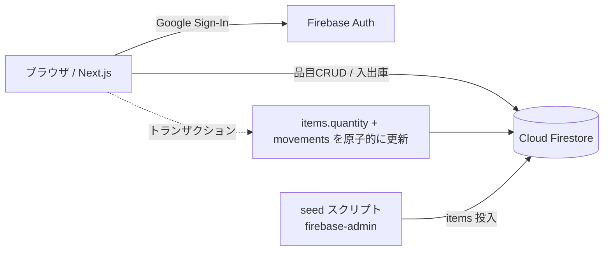

# Inventory Manager

備品・消耗品の在庫を管理する小規模チーム向けの在庫管理アプリ（PoC / ポートフォリオ）。
品目マスタの管理、入出庫・棚卸調整、発注点による低在庫アラート、品目ごとの履歴を提供します。

> 汎用サンプルとして一から実装したものです。特定企業のデータ・資産・社内システムには依存しません。

## ライブデモについて

https://inventory-portfolio-one.vercel.app で公開しています。「小規模チームで共有する台帳」という
設計のため、Googleログインさえすれば**誰でも全品目を編集・削除できます**（所有者の概念なし）。
訪問者ごとの分離もありません。デモ用途のため予告なくデータをリセットする場合があります。

[プライバシーポリシー](https://inventory-portfolio-one.vercel.app/privacy) ／
[利用規約](https://inventory-portfolio-one.vercel.app/terms)

## 主な機能

- 🔐 Googleアカウントでのログイン（Firebase Authentication）
- 📦 品目マスタの登録・編集・削除
- ⬆️⬇️ 入庫・出庫・棚卸調整（在庫数と履歴をトランザクションで原子的に更新）
- ⚠️ 発注点による低在庫アラート／低在庫のみ絞り込み表示
- 🧾 品目ごとの入出庫履歴（監査ログとして更新・削除は不可）

## 技術スタックと選定理由

| 領域 | 採用 | 理由 |
|---|---|---|
| フロント | Next.js 16 (App Router / TypeScript) | 型安全・App Routerで見通しの良い構成 |
| スタイル | Tailwind CSS | 一覧・モーダルUIを素早く一貫したデザインで実装 |
| 認証 | Firebase Authentication | Googleログインを最小実装で導入 |
| DB | Cloud Firestore | トランザクションで在庫と履歴の整合を担保 |
| テスト | Vitest | 在庫計算・低在庫判定ロジックのユニットテスト |

## アーキテクチャ



## データモデル

- `items/{id}` … 品目: `name, sku, category, quantity, minQuantity, unit, location, updatedAt`
- `movements/{id}` … 入出庫履歴: `itemId, type(in|out|adjust), delta, resultingQuantity, reason, userId, userName, createdAt`

在庫増減と低在庫判定は UI/DB に依存しない純関数（`lib/stock.ts`）に切り出し、
`lib/__tests__/stock.test.ts` でカバーしています。在庫数の更新は Firestore トランザクション
（`lib/inventory.ts` の `applyStockMovement`）で、数量更新と履歴追加を原子的に行います。

## セットアップ

### 1. 依存インストール

```bash
npm install
```

### 2. Firebase プロジェクト準備

1. [Firebase Console](https://console.firebase.google.com/) で無料プロジェクトを作成
2. Authentication → Sign-in method → **Google** を有効化
3. Firestore Database を作成（本番モード）
4. プロジェクトの設定 → マイアプリ（Web）を追加し、設定値を控える

### 3. 環境変数

```bash
cp .env.local.example .env.local
# .env.local に Firebase の設定値を入力
```

### 4. セキュリティルール適用

`firestore.rules` の内容を Firebase Console の Firestore → ルール に貼り付けて公開。

### 5. 初期データ投入

サービスアカウント鍵（プロジェクトの設定 → サービスアカウント → 新しい秘密鍵）を
`serviceAccountKey.json` として保存（コミット禁止・`.gitignore`済み）。

```bash
GOOGLE_APPLICATION_CREDENTIALS=./serviceAccountKey.json npm run seed
```

### 6. 起動

```bash
npm run dev      # http://localhost:3000
npm test         # 在庫ロジックのテスト
npm run build    # 本番ビルド
```

## デプロイ

Firebase Hosting か Vercel にデプロイ可能。環境変数（`NEXT_PUBLIC_FIREBASE_*`）を
デプロイ先に設定すればそのまま動作します。

## ライセンス

MIT
